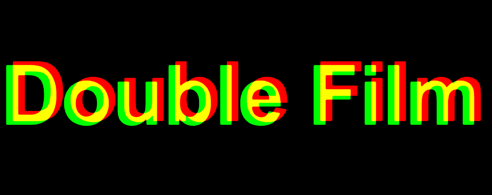
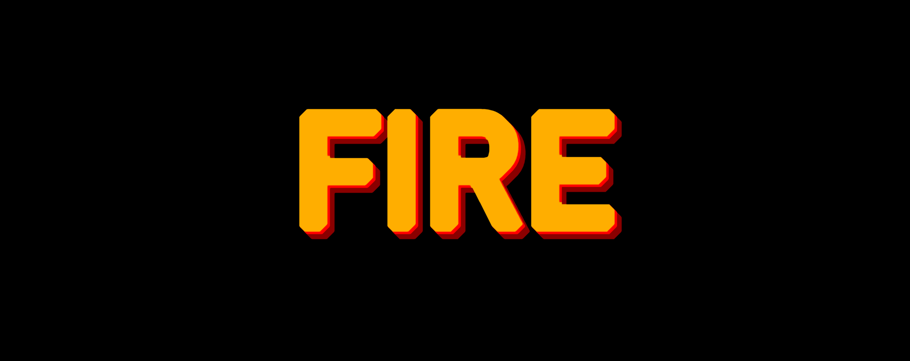

# sandbox-sdf

Playground for experimenting with signed distance field textures for shape and text rendering. The main goal for this project is helping me to develop an understanding of how real-time effects can be achieved using SDFs, and define a reasonable set of parameters to fine-tune the effects on different scenarios.

It is based on the original work presented in the [Improved Alpha-Tested Magnification for Vector Textures and Special Effects](https://steamcdn-a.akamaihd.net/apps/valve/2007/SIGGRAPH2007_AlphaTestedMagnification.pdf) paper by Chris Green from Valve.

## Live demo

[https://ruben3d.github.io/sandbox-sdf/dist](https://ruben3d.github.io/sandbox-sdf/dist)


## Examples

[](doc/01.png)
[](doc/02.png)
[](doc/03.png)
[](doc/04.png)
[](doc/05.png)
[](doc/06.png)

## How to build

You need node.js installed globally (I have been using 22.11.0).

```
$ cd sandbox-sdf
$ npm i
$ npm run build
```

## How to run

Start the local web server:

```
$ cd sandbox-sdf
$ npm run serve
```
Then open `localhost:8000` in your web browser (tested on Chrome/Windows).

## FAQ

***Q: It is easy to get ugly/broken results, is there something wrong?***<br>
***A:*** I allow pushing the values far beyond what I know will look good to better understand the limits in a wide range of situations.

***Q: What do the values represent? Are they pixels?***<br>
***A:*** No. In a signed distance field compressed into a grayscale texture, values from 0 to 0.5 represent the distance to the external boundary, values from 0.5 to 1.0 the distance to the internal boundary, and the boundary lays exactly at 0.5. No effect can be applied beyond these values, thus the *Spread* SDF generation parameter effectively controls the maximum spread of any kind of effect. The values in the slider represent offsets in this range (e.g. if the boundary is at 0.5, the stroke thickness can't be larger than 0.5, to keep it within the [0,1] range).

***Q: Why use a SDF instead of a convolution matrix for these effects?***<br>
***A:*** A SDF texture allows for a good quality result with a small source texture, and a single texture lookup (unless requiring offsets in shadows, then an extra lookup is needed). The drawback is that the behaviour is not intuitive, and requires some understanding of how it works to get good results.

***Q: There are many opportunities for optimising the shader, would you do it?***<br>
***A:*** No, this project is for me to experiment with SDF textures. It is not intended for use in production. I prime clarity over performance.

***Q: Why do text SDF textures take that long to generate?***<br>
***A:*** It uses the brute force approach described in the original paper, [Improved Alpha-Tested Magnification for Vector Textures and Special Effects](https://steamcdn-a.akamaihd.net/apps/valve/2007/SIGGRAPH2007_AlphaTestedMagnification.pdf). *Source scale* above 4 and *Spread* above 6 will introduce very noticeable delays. Higher numbers can take up to a few minutes.

***Q: Could you make the text SDF generation faster?***<br>
***A:*** Yes, I could introduce multithreading, or use the jump flooding algorithm (JFA). At this time my main goal is experimenting with the SDF textures once generated, not investing much effort in the  generation itself.

***Q: Why are shape SDF textures so fast?***<br>
***A:*** They perform analytical distance calculations, based on [the work by iquilez](https://iquilezles.org/articles/distfunctions2d/).

***Q: Couldn't the SDF and gradient for shapes be calculated within the shader?***<br>
***A:*** Yes, and that's what I would do in production code. Just move the distance function into the shader and replace the texture lookup. For now I prefer to keep it simple with a single path in the shader.

***Q: Why does the Bevel effect look funny?***<br>
***A:*** I marked it as experimental as it is showing some low frequency artifacts, and I'm still deciding on the best control parameters and blending mode.

***Q: How do you calculate the gradient for the Bevel effect?***<br>
***A:*** Partial derivatives over the SDF sample. I use the hardware-implemented `dFdx` and `dFdy` GLSL functions. They are fast, don't require extra texture lookups, but their accuracy is limited to 2x2 fragment blocks.

***Q: Could it generate a font atlas and use it to render any text on the fly?***<br>
***A:*** It could, but it isn't part of my goals at this time. Doing this is left as an exercise for the reader.

***Q: Why didn't you use React/Angular/Whatever?***<br>
***A:*** I wanted something simple with fast build times to enable quick iterations (~3s in my system). The UI code has grown organically so don't use it as a reference on good UI practices. Quick results over pretty code.

***Q: Why don't you use the npm package X to perform the task Y?***<br>
***A:*** I don't want unnecessary runtime dependencies. Just `three` for rendering.
